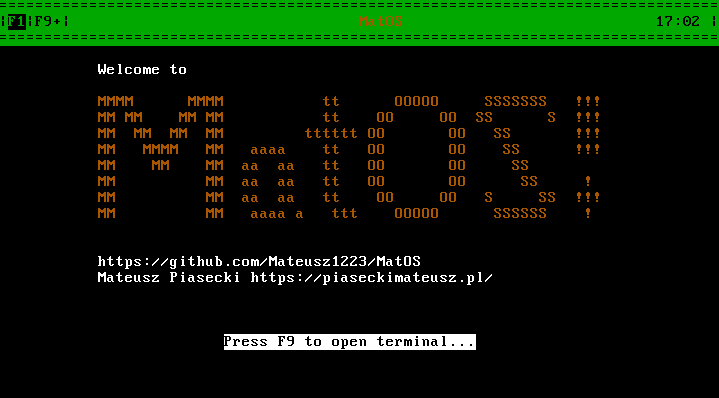
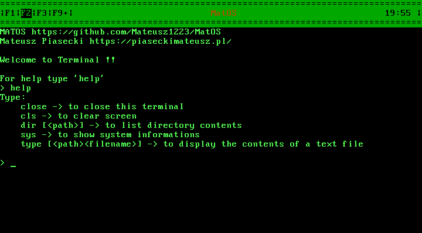

# MatOS

MatOS is a hobby operating system developed from scratch in C.

# Compilation

MatOS uses a PE file as a kernel so it is recomended to build it on Windows machine. You can, however, use `i686-w64-mingw32-gcc` command to compile it under linux but it will require a small modification of `build.py` script.

To compile MatOS type: 

`mkdir build`

`python3 build.py`

Note that build.py script uses programs such as `nasm`, `strip` or `gcc`, that need to be available in the project folder or added to PATH.

`build.py` will create 64MB `matos.img` file in `/build` folder which you can use as a disk image on emulators or you can write it on a storage device using programs like `rufus` and run it on a real hardware.

Welcome screen:

Terminal:

System informations:

Reading files and directories:

MatOS on real computer:

